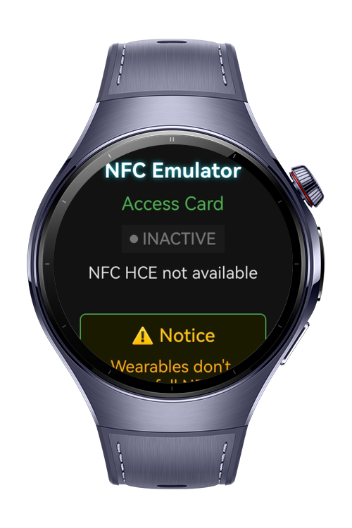
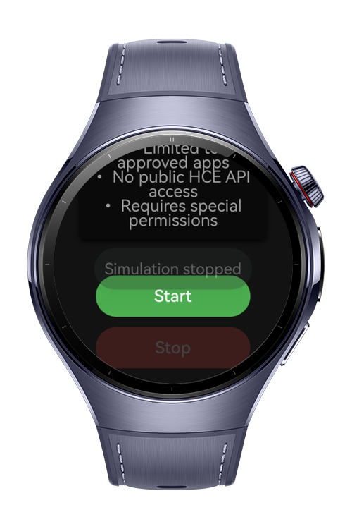

> **Note:** To access all shared projects, get information about environment setup, and view other guides, please visit [Explore-In-HMOS-Wearable Index](https://github.com/Explore-In-HMOS-Wearable/hmos-index).

# NFC HCE Simulator

This is a wearable demo app that simulates **Host Card Emulation (HCE)** transactions. The project provides a **simulation-only environment** to test UI, interactions, and flow of card emulation features.

# Preview

<div>
    
    
    
    
</div>

# Use Cases

- Start and stop simulated NFC card emulation.
- Get active/inactive **status indicators**.
- See warnings about **limitations of wearables** regarding NFC HCE.
- Learn about actual NFC usage on wearables (Huawei Pay, system-level services, special permissions).

# Tech Stack

- **Languages**: ArkTS, ArkUI
- **Frameworks**: HarmonyOS SDK 4.0+
- **Tools**: DevEco Studio
- **Libraries**: @kit.ArkUI, @kit.PerformanceAnalysisKit

# Directory Structure
```
entry/src/main/ets/
|---entryability
| |---EntryAbility.ets
|
|---pages
| |---HCEPage.ets
| |---Index.ets
| |---SplashPage.ets
|
|---viewmodels
| |---SplashViewModel.ets
```
# Supported Devices

- Wearable devices running **HarmonyOS 4.0+**

# Limitations

- **No real NFC HCE functionality** (simulation only).
- Transactions are pre-defined mock events.
- Intended for **demo and UI/UX testing purposes**.

# LICENSE

NFC HCE Simulator is distributed under the terms of the MIT License.  
See the [LICENSE](/LICENSE) for more information.
